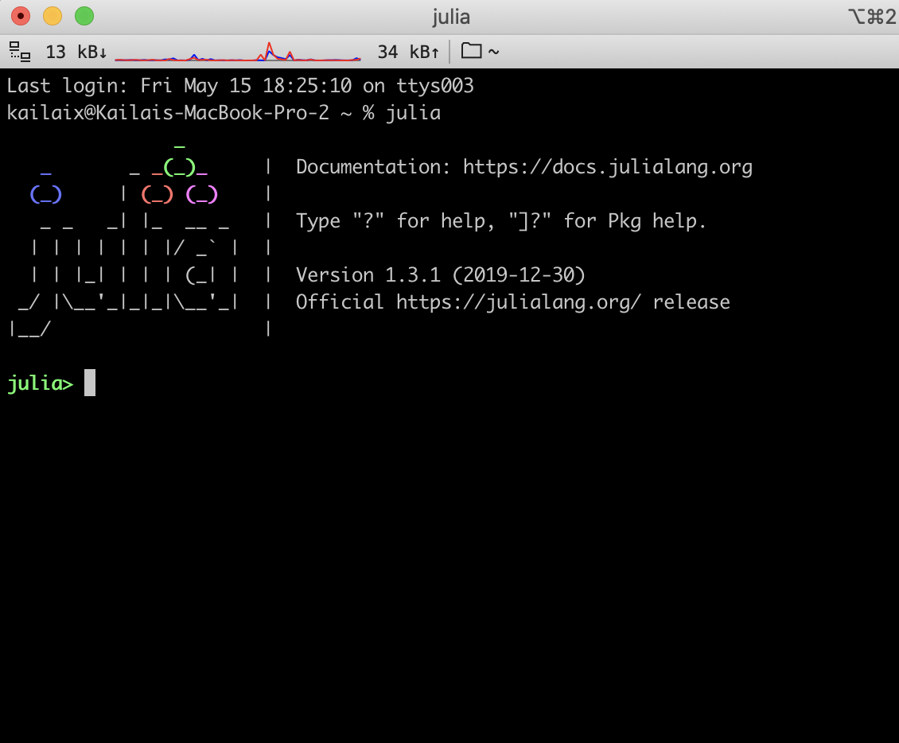
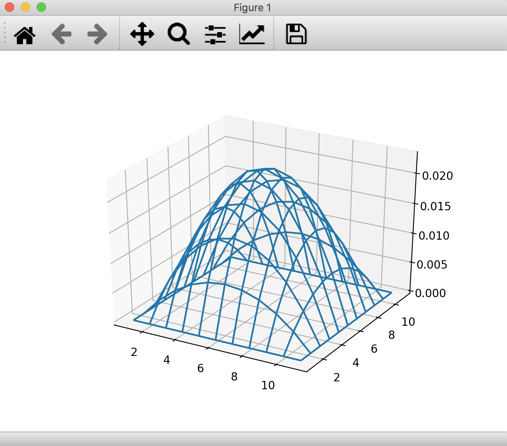

ADCME is tested and supported on Linux and MacOS systems. The support for custom operators on Windows is not available yet. We have separate instructions for MacOS and Linux systems. 

If you only have a Windows machine, you can use the Stanford [Farmshare](https://srcc.stanford.edu/farmshare2) computing environment. ssh to `rice.stanford.edu` using your SUNetID.

# Install ADCME

## 1. Install Julia

### For MacOS

Due to an incompatibility issue with Julia 1.4 and TensorFlow 1.x, please download and install Julia 1.3 from the [official website](https://julialang.org/downloads/oldreleases/#v131_dec_30_2019). 

After installation, Julia-1.3 will appear in your `Application` folder. Open the Julia application and you will see the Julia prompt

```julia
julia> Sys.BINDIR
```

Example output:

```bash
"/Applications/Julia-1.3.app/Contents/Resources/julia/bin"
```

Add this path to your `PATH` environment variable (make sure to scroll to the right to copy the entire line below)

```bash
echo 'export PATH=/Applications/Julia-1.3.app/Contents/Resources/julia/bin:$PATH' >> ~/.bash_profile
```

On the most recent version of MacOS, you need to replace `~/.bash_profile` by `~/.zshrc`. If you are unsure, type `ls ~/.zshrc`. If the file exists, this is the one you should use.

### For Linux 

Download Julia 1.3 or 1.4 from the [official website](https://julialang.org/downloads/). Uncompress the tarball to any directory you want. There is a directory `bin` inside the Julia directory you just uncompressed. Add the absolute path of the `bin` directory to your `PATH` environment variable. 

Suppose the Julia `bin` path is `<LocalJuliaPath>` (e.g., `~/julia-1.4.1/bin`), execute the following command in your terminal:

```bash
echo 'export PATH=<LocalJuliaPath>:$PATH' >> ~/.bashrc
```

In case you use another shell (e.g., `zsh`) other than bash, you need to replace `~/.bashrc` in the command with the corresponding startup file. You can use `echo $SHELL` to check which shell you are using. 

---

Restart your shell to apply the new settings. Type `julia` in your terminal and you should see a Julia prompt.




## 2. Install Project Dependencies

This homework requires installing some Julia packages. Open your julia 

```bash
$ julia
```

and type

```julia
julia> using Pkg
julia> Pkg.add("ADCME")
julia> Pkg.add("DelimitedFiles")
julia> Pkg.add("Conda")
julia> Pkg.add("PyCall")
julia> Pkg.add("PyPlot")
julia> Pkg.build("PyPlot") # important: force PyPlot to use the correct Python version
```

Installing ADCME will take up to 10 minutes for the first time. 


## 3. Start using ADCME

Now you can start using ADCME (ignore the warnings; they will disappear next time)

```julia
julia> using ADCME
julia> a = constant(ones(5,5))
julia> b = a * ones(5)
julia> sess = Session(); init(sess)
julia> run(sess, b)
```

Expected output:

```bash
5-element Array{Float64,1}:
 5.0
 5.0
 5.0
 5.0
 5.0
```


## 4. Test Custom Operator Support

In the homework we will use custom operators. To test whether your installation works for custom operators, try

```julia
julia> using ADCME
julia> ADCME.precompile()
```

If you encounter any compilation issue, you can report in Slack channel. 


# Compile the Custom Operator for 2D Case

The final step explains how to compile the custom operator for the 2D Case. 

In `2DCase`, you have two source files: `HeatEquation.h` and `HeatEquation.cpp`. You need to compile them into a shared library, which you can use in the inverse modeling. To do so, go into `2DCase` directory and open a Julia prompt in a terminal. 

```julia
julia> using ADCME
julia> mkdir("build")
julia> cd("build")
julia> ADCME.cmake()
julia> ADCME.make()
```

You will see there is a `libHeatEquation.dylib` (MacOS) or `libHeatEquation.so` (Linux) in your `build` directory. 

Run the `Case2D/example.jl` file to check if the shared library works. You may see some warning messages. If you see the following output at the end:

```shell
run(sess, err) = 2.9971950130484027e-6
Congratulations! `example.jl` completed successfully
```

the code ran successfully.

If you run the code within the Julia REPL, you will see a figure. For this, start julia:

```shell
$ julia
```

Then type:

```shell
julia> include("example.jl")
```
 
You will see the same output as above `run(sess, err) = 2.9971950130484027e-6` along with this figure:

{:width="80%"}

You can rotate the figure in 3D using your mouse.

---

Note: On some Mac systems, you may encounter the following warning when you run `using PyPlot`.

> On Mac, the PyPlot package gives the warning: PyPlot is using tkagg backend, which is known to cause crashes on MacOS (#410); use the MPLBACKEND environment variable to request a different backend.

To fix this problem, run the following command
```julia
using Conda
Conda.add("pyqt", :ADCME)
using Pkg
Pkg.build("PyPlot")
