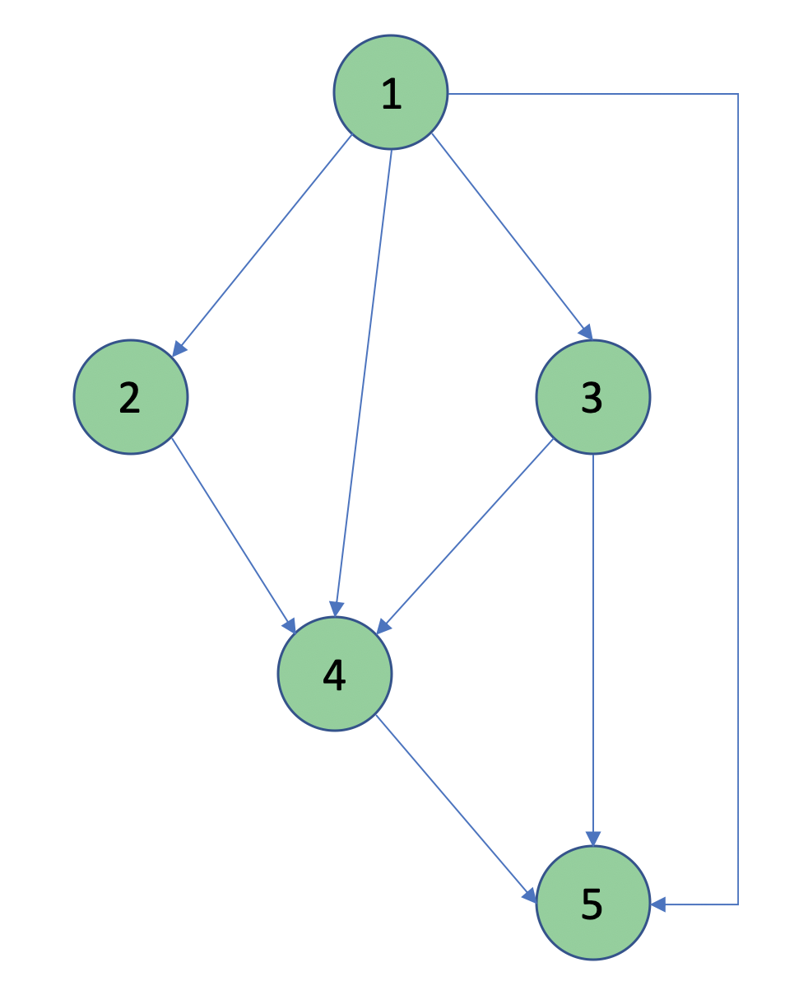

These questions refer to the slide deck "2.2 Artificial Neural Networks (multilayer perceptron)". 

Write your answers in a PDF and upload the document on [gradescope](https://www.gradescope.com/courses/102338) for submission.

Each question is worth 10 points. The due date is given on [gradescope](https://www.gradescope.com/courses/102338). Post on [Slack](https://stanford.enterprise.slack.com/) for questions.

Late day policy: 1 late day with a 20% grade penalty.

1. Consider a perceptron where $$\phi$$ is a linear function, e.g., $$\phi(x) = x$$; show that for the XOR problem, there is no linear perceptron that can reproduce this data.
1. Consider the figure below. This is a directed acyclic graph or DAG. Assume that node 1 is set equal to the input $$x$$. We build an ANN based on this graph. The output $$y$$ is at node 5. Explain in general terms the sequence of operations the ANN performs to transform the input $$x$$ to the output $$y$$ following this DAG. Assume that the activation function is some given function $$\phi(x)$$.
1. Consider a generic multi-layer stacked perceptron. Describe in general terms what the sequence of operations that are performed is, going from the input layer to the output layer.

{:width="60%"}

